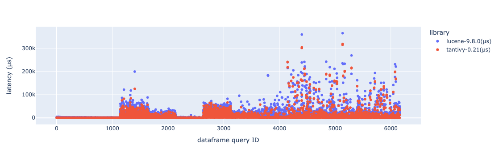

# Analyzing Search Benchmark Game Data in Jupyter Notebooks
Tested with Python 3.11
## Using pipenv
```
% pipenv install
Creating a virtualenv for this project...
✔ Successfully created virtual environment! 
% pipenv shell
(notebooks) % pipenv install jupyter 
Installing jupyter...
Adding jupyter to Pipfile's [packages]...
✔ Installation Succeeded 
Pipfile.lock (51d3e4) out of date, updating to (a6b6f5)...
Locking [dev-packages] dependencies...
Locking [packages] dependencies...
Building requirements...
Resolving dependencies...
✔ Success! 
% pipenv install pandas
Installing pandas...
Adding pandas to Pipfile's [packages]...
✔ Installation Succeeded 
(notebooks) % jupyter notebook
```

Running all cells on the notebook will produce a chart like this. In the notebook, you can mouseover datapoints to see
the actual query.

